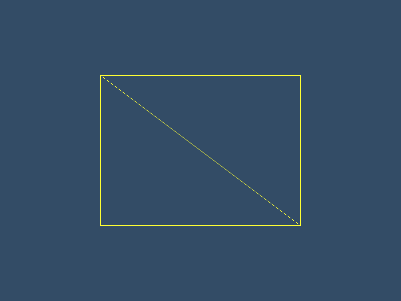

# LearnOpenGLProjects

#### 介绍

https://learnopengl-cn.github.io/ 相关学习示例

<h3 align="center">Gold Sponsors</h3>
<table>
    <tbody>
        <tr>
            <td align="center" valign="middle">
                
            </td>
            <td align="center" valign="middle">
                
            </td>
            <td align="center" valign="middle">
                
            </td>
              <td align="center" valign="middle">
                
            </td>
            <td align="center" valign="middle">
                
            </td>
            <td align="center" valign="middle">
                
            </td>
        </tr>
        <tr></tr>
        <tr>
            <td align="center" valign="middle">
                
            </td>
            <td align="center" valign="middle">
                
            </td>
            <td align="center" valign="middle">
                
            </td>
            <td align="center" valign="middle">
                
            </td>
            <td align="center" valign="middle">
                
            </td>
            <td align="center" valign="middle">
                
            </td>
        </tr>
        <tr></tr>
    </tbody>
</table>
