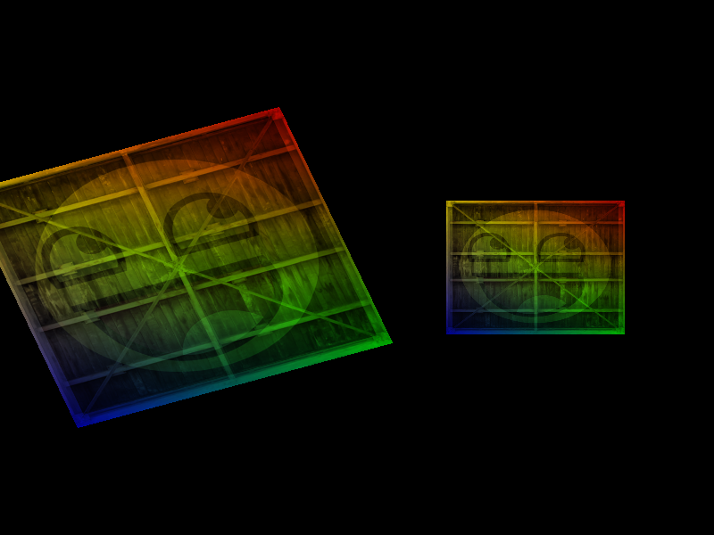

    <h2 align="center">LearnOpenGLProjects</h2>
    <h4 align="center">
        <a href="https://learnopengl-cn.github.io/"
            >https://learnopengl-cn.github.io/</a
        >
        相关学习示例
    </h4>
    <h2 align="center">Example screenshot</h2>
    

        

            
            
            
            
            
        

        

            
            
            
            
            
        

    

