

    <h2 align="center">LearnOpenGLProjects</h2>
    <h4 align="center">
        
            <a href="https://learnopengl-cn.github.io/"
                >learnopengl-cn</a
            >
            相关学习示例 -->IDE:vs2015 -->config:Debug win32
        
    </h4>
    <h2 align="center">Example screenshot</h2>
    

        

            
            
            
            
            
            
        

        

            
            
            <a
                style="margin: 10px"
                href="https://github.com/yocover/opengl-learning-example/tree/main/Examples/09-UseCamera"
                title="09-UseCamera"
                >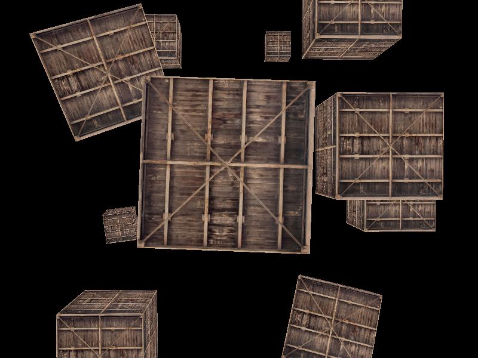</a>
            <a
                style="margin: 10px"
                href="https://github.com/yocover/opengl-learning-example/tree/main/Examples/10-BaseLight"
                title="10-BaseLight"
                >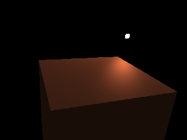</a>
            <a
                style="margin: 10px"
                href="https://github.com/yocover/opengl-learning-example/tree/main/Examples/11-UseImgui"
                title="11-UseImgui"
                >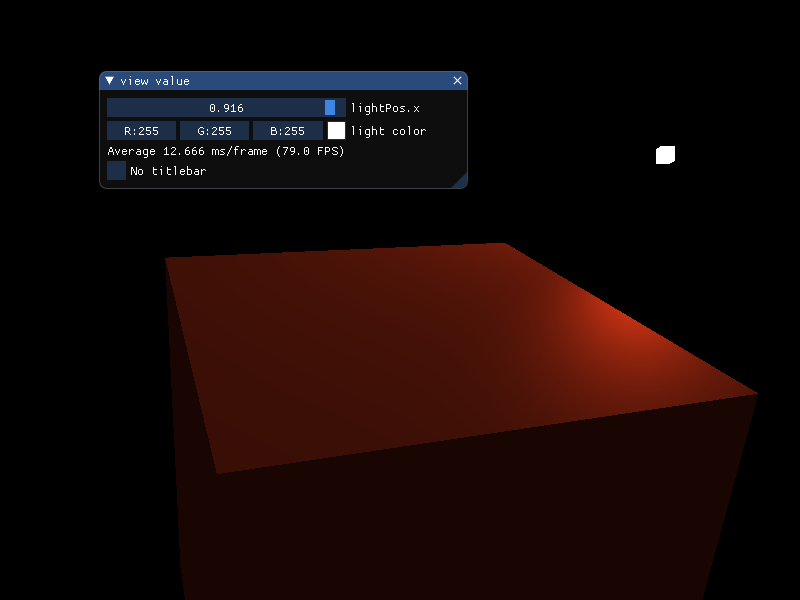</a>
            <a
                style="margin: 10px"
                href="https://github.com/yocover/opengl-learning-example/tree/main/Examples/12-LightMaterial"
                title="12-LightMaterial"
                >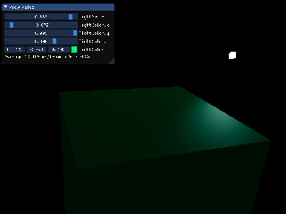</a>
        

        

            <a
                style="margin: 10px"
                href="https://github.com/yocover/opengl-learning-example/tree/main/Examples/13-MaterialPractice"
                title="13-MaterialPractice"
                >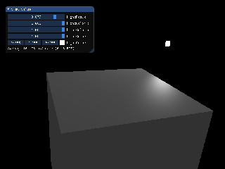</a>
            <a
                style="margin: 10px"
                href="https://github.com/yocover/opengl-learning-example/tree/main/Examples/14-LightMap"
                title="14-LightMap"
                >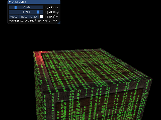</a>
            <a
                style="margin: 10px"
                href="https://github.com/yocover/opengl-learning-example/tree/main/Examples/15-DirectionalLight"
                title="15-DirectionalLight"
                >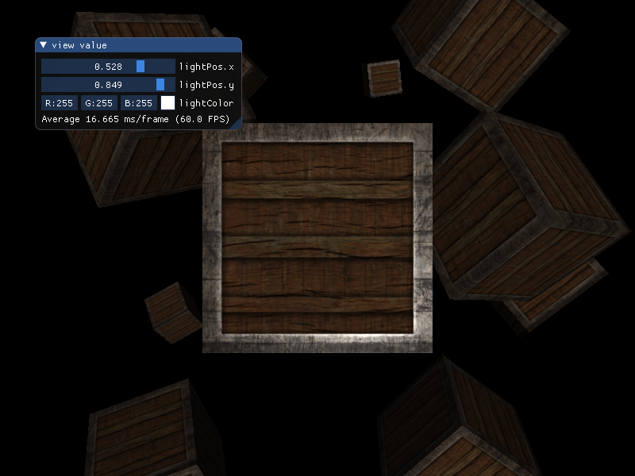</a>
            <a
                style="margin: 10px"
                href="https://github.com/yocover/opengl-learning-example/tree/main/Examples/16-PointLight"
                title="16-PointLight"
                >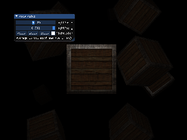</a>
            <a
                style="margin: 10px"
                href="https://github.com/yocover/opengl-learning-example/tree/main/Examples/17-Spotlight"
                title="17-Spotlight"
                >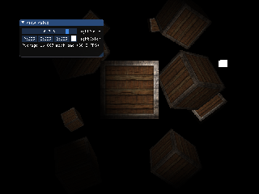</a>
            <a
                style="margin: 10px"
                href="https://github.com/yocover/opengl-learning-example/tree/main/Examples/18-Multiplelights"
                title="18-Multiplelights"
                >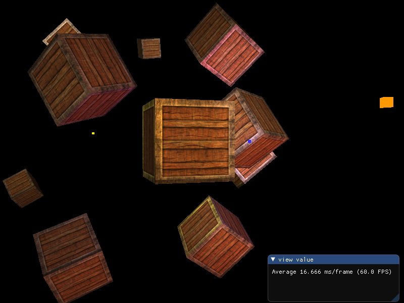</a>
        

        

            <a
                style="margin: 10px"
                href="https://github.com/yocover/opengl-learning-example/tree/main/Examples/19-UseAssimp"
                title="19-UseAssimp"
                >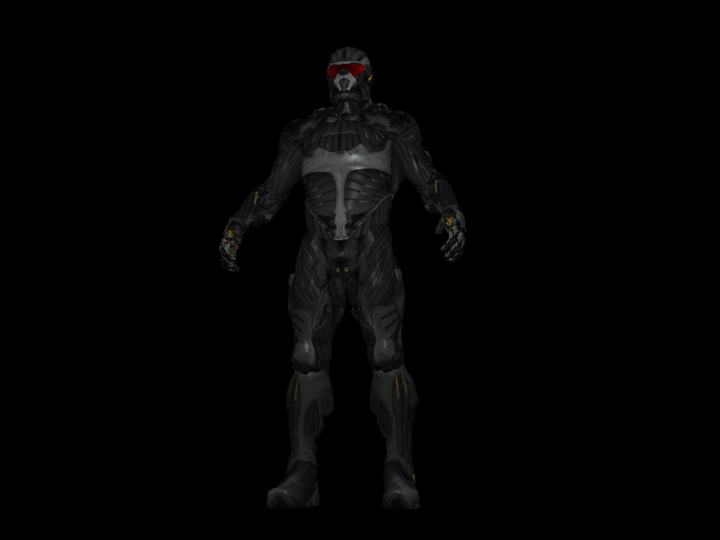</a>
            <a
                style="margin: 10px"
                href="https://github.com/yocover/opengl-learning-example/tree/main/Examples/20-LoadModel"
                title="20-LoadModel"
                >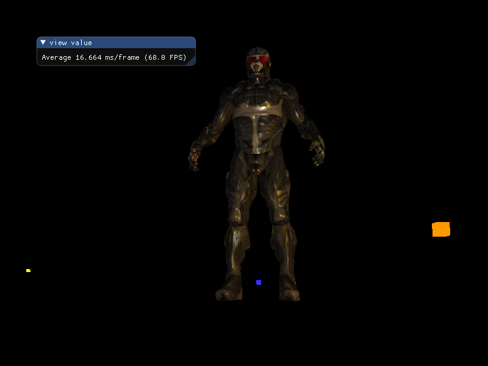</a>
            <a
                style="margin: 10px"
                href="https://github.com/yocover/opengl-learning-example/tree/main/Examples/21-DephTest"
                title="21-DephTest"
                >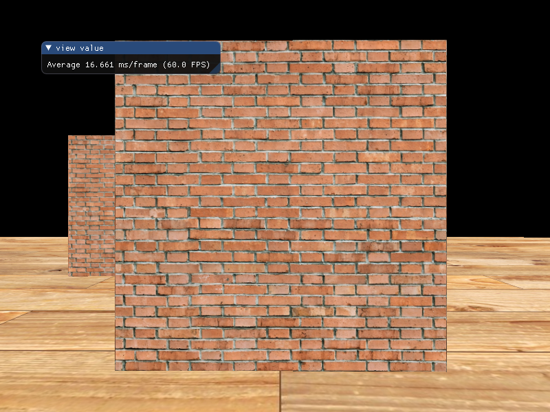</a>
            <a
                style="margin: 10px"
                href="https://github.com/yocover/opengl-learning-example/tree/main/Examples/22-StencilTest"
                title="22-StencilTest"
                >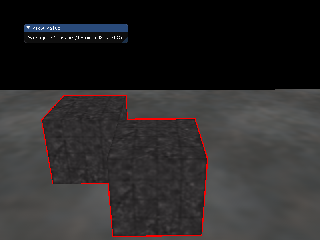</a>
            
            <a
                style="margin: 10px"
                href="https://github.com/yocover/opengl-learning-example/tree/main/Examples/24-FaceCulling"
                title="24-FaceCulling"
                >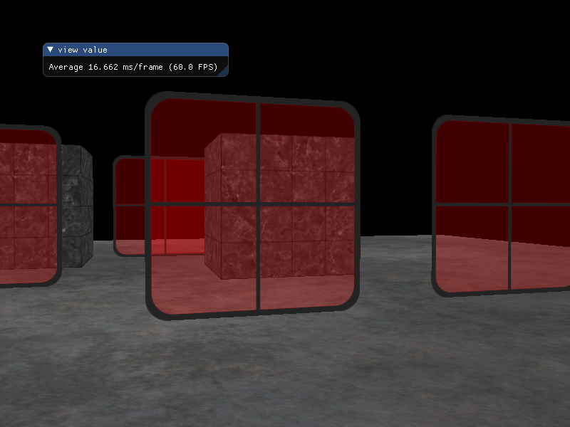</a>
        

        

            <a
                style="margin: 10px"
                href="https://github.com/yocover/opengl-learning-example/tree/main/Examples/25-Framebuffers"
                title="25-Framebuffers"
                >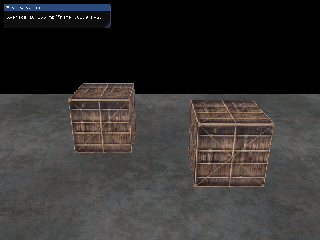</a>
            <a
                style="margin: 10px"
                href="https://github.com/yocover/opengl-learning-example/tree/main/Examples/26-Cubemaps"
                title="26-Cubemaps"
                >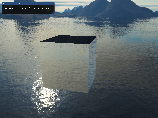</a>
            <a
                style="margin: 10px"
                href="https://github.com/yocover/opengl-learning-example/tree/main/Examples/27-BufferSubData"
                title="27-BufferSubData"
                >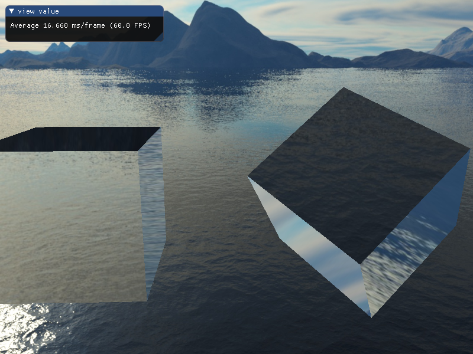</a>
            <a
                style="margin: 10px"
                href="https://github.com/yocover/opengl-learning-example/tree/main/Examples/28-BuiltInVariable"
                title="28-BuiltInVariable"
                >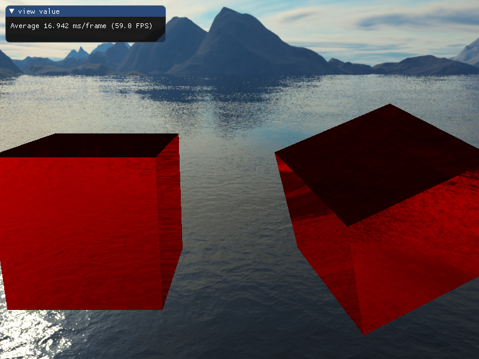</a>
            <a
                style="margin: 10px"
                href="https://github.com/yocover/opengl-learning-example/tree/main/Examples/29-UniformBuffer"
                title="29-UniformBuffer"
                >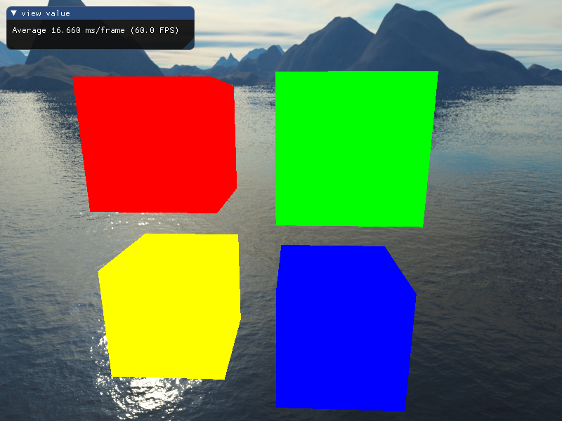</a>
            <a
                style="margin: 10px"
                href="https://github.com/yocover/opengl-learning-example/tree/main/Examples/30-GeometryShader"
                title="30-GeometryShader"
                >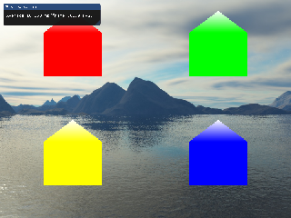</a>
        

        

            <a
                style="margin: 10px"
                href="https://github.com/yocover/opengl-learning-example/tree/main/Examples/31-ObjectExplode"
                title="31-ObjectExplode"
                >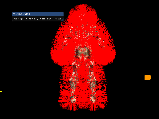</a>
            <a
                style="margin: 10px"
                href="https://github.com/yocover/opengl-learning-example/tree/main/Examples/32-Instancing"
                title="32-Instancing"
                >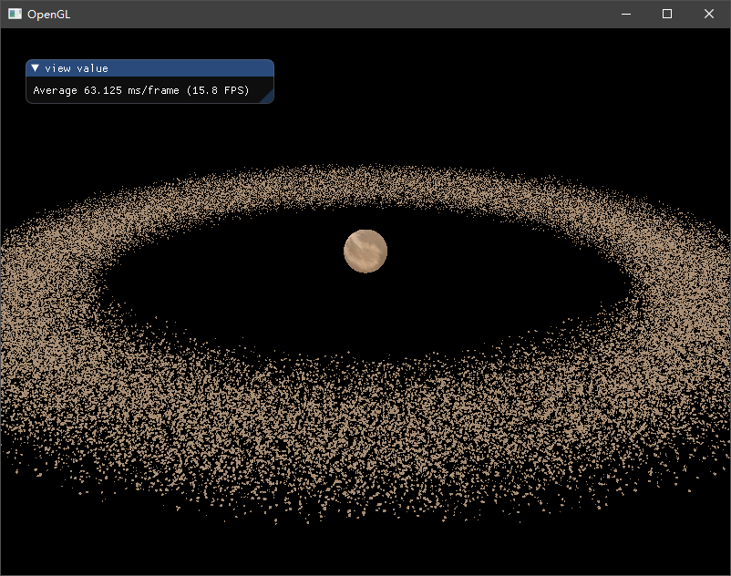</a>
            <a
                style="margin: 10px"
                href="https://github.com/yocover/opengl-learning-example/tree/main/Examples/33-AntiAliasing"
                title="33-AntiAliasing"
                >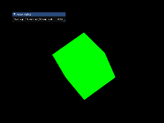</a>
            <a
                style="margin: 10px"
                href="https://github.com/yocover/opengl-learning-example/tree/main/Examples/34-BlinnPhong"
                title="34-BlinnPhong"
                >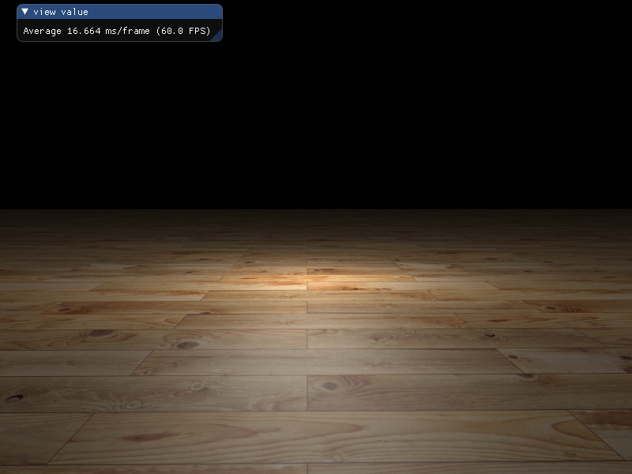</a>
            <a
                style="margin: 10px"
                href="https://github.com/yocover/opengl-learning-example/tree/main/Examples/35-GammaCorrection"
                title="35-GammaCorrection"
                >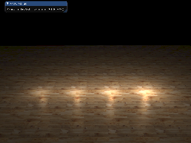</a>
            <a
                style="margin: 10px"
                href="https://github.com/yocover/opengl-learning-example/tree/main/Examples/36-ShadowMapping"
                title="36-ShadowMapping"
                >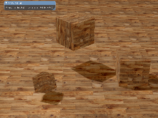</a>
        

        

            <a
                style="margin: 10px"
                href="https://github.com/yocover/opengl-learning-example/tree/main/Examples/37-PointShadows"
                title="37-PointShadows"
                >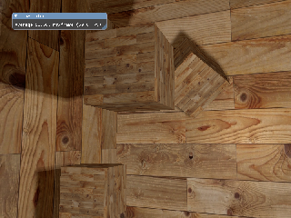</a>
            <a
                style="margin: 10px"
                href="https://github.com/yocover/opengl-learning-example/tree/main/Examples/38-NormalMapping"
                title="38-NormalMapping"
                >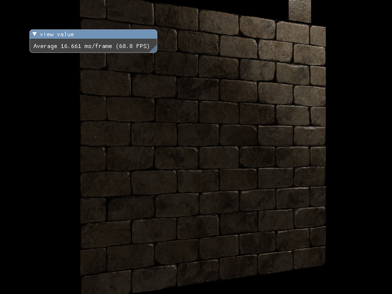</a>
            <a
                style="margin: 10px"
                href="https://github.com/yocover/opengl-learning-example/tree/main/Examples/39-ParallaxMapping"
                title="39-ParallaxMapping"
                >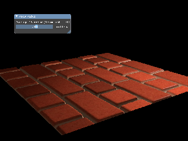</a>
            <a
                style="margin: 10px"
                href="https://github.com/yocover/opengl-learning-example/tree/main/Examples/40-HighDynamicRange"
                title="40-HighDynamicRange"
                >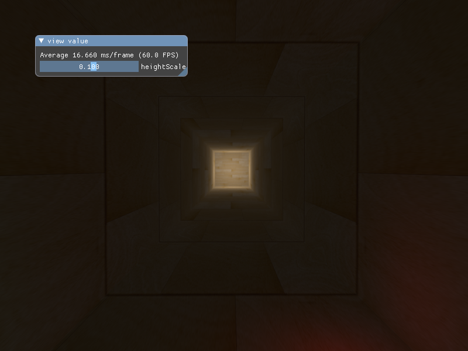</a>
            <a
                style="margin: 10px"
                href="https://github.com/yocover/opengl-learning-example/tree/main/Examples/41-Bloom"
                title="41-Bloom"
                >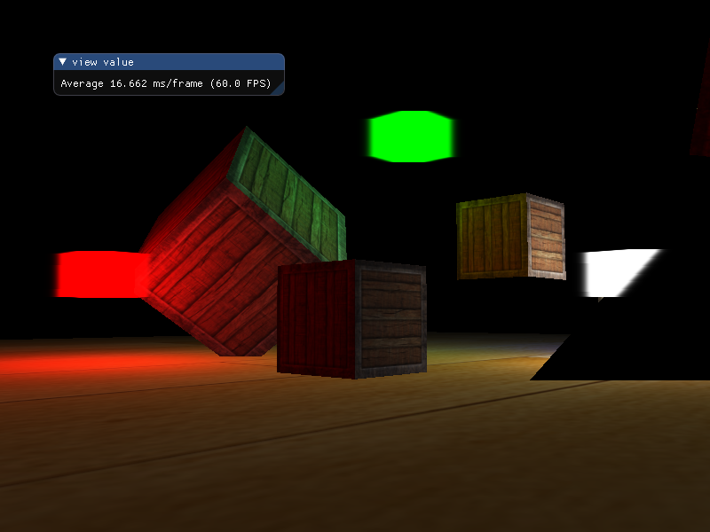</a>
        

    

